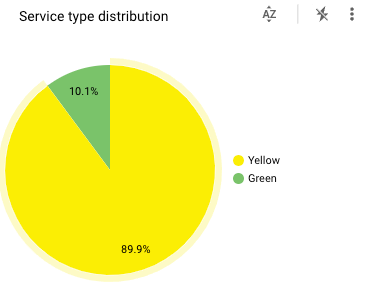

# Week 4 Homework 

In this homework, we'll use the models developed during the week 4 videos and enhance the already presented dbt project using the already loaded Taxi data for fhv vehicles for year 2019 in our DWH.

We will use the data loaded for:
* Building a source table: stg_fhv_tripdata
* Building a fact table: fact_fhv_trips
* Create a dashboard 

If you don't have access to GCP, you can do this locally using the ingested data from your Postgres database
instead. If you have access to GCP, you don't need to do it for local Postgres -
only if you want to.

# Question 1: 
**What is the count of records in the model fact_trips after running all models with the test run variable disabled and filtering for 2019 and 2020 data only (pickup datetime)**  
You'll need to have completed the "Build the first dbt models" video and have been able to run the models via the CLI. 
You should find the views and models for querying in your DWH.
>Code:
```sql
SELECT count(*) FROM `animated-surfer-338618.production.fact_trips`
WHERE EXTRACT(YEAR FROM pickup_datetime) IN  (2019, 2020) 
```
>Answer (incorrect):
```
Code output:
61630138

Chosen answer:
61635151
```
>Notes:

Due to the way we deduplicated records, many students got different answers for this question, so it will not be scored.

The proposed code matches exactly my code, but the count they got was 61635418. You can check the solution video [in this link](https://www.youtube.com/watch?v=I_K0lNu9WQw&list=PL3MmuxUbc_hJed7dXYoJw8DoCuVHhGEQb&index=46).


# Question 2: 
**What is the distribution between service type filtering by years 2019 and 2020 data as done in the videos**

You will need to complete "Visualising the data" videos, either using data studio or metabase. 

>Code:



>Answer (correct):
```
89.9/10.1
```

# Question 3: 
**What is the count of records in the model stg_fhv_tripdata after running all models with the test run variable disabled (:false)**  

Create a staging model for the fhv data for 2019 and do not add a deduplication step. Run it via the CLI without limits (is_test_run: false).
Filter records with pickup time in year 2019.
>Code 1: [stg_fhv_tripdata.sql](taxi_rides_ny_bq/models/staging/stg_fhv_tripdata.sql)

>Code 2:
```sql
SELECT count(*) FROM `animated-surfer-338618.dbt_dev.stg_fhv_tripdata`
where extract(year from pickup_datetime) in (2019)
```
>Answer (correct):
```
42084899
```
> Proposed code 1 - `stg_fhv_tripdata.sql`
```sql
{{ config(materialized='view')}}

select
    dispatching_base_num,

    cast(PULocationID as integer) as pickup_locationid,
    cast(DOLocationID as integer) as dropoff_locationid,

    --timestamps
    cast(pickup_datetime as timestamp) as pickup_datetime,
    cast(dropoff_datetime as timestamp) as dropoff_datetime,

    --trip info
    sr_flag
from {{ source('staging', 'fhv_tripdata')}}
```
> Proposed code 2
```sql
SELECT count(*) FROM `animated-surfer-338618.dbt_dev.stg_fhv_tripdata`
where extract(year from pickup_datetime) in (2019)
```

# Question 4: 
**What is the count of records in the model fact_fhv_trips after running all dependencies with the test run variable disabled (:false)**  

Create a core model for the stg_fhv_tripdata joining with dim_zones.
Similar to what we've done in fact_trips, keep only records with known pickup and dropoff locations entries for pickup and dropoff locations. 
Run it via the CLI without limits (is_test_run: false) and filter records with pickup time in year 2019.

>Code 1: [fact_fhv_trips.sql](taxi_rides_ny_bq/models/core/fact_fhv_trips.sql)

>Code 2:
```sql
SELECT count(*) FROM `animated-surfer-338618.dbt_dev.fact_fhv_trips`
where extract(year from pickup_datetime) in (2019)
```

>Answer (correct):
```
22676253
```

>Proposed code 1 - `stg_fhv_trips.sql`
```sql
{{ config(materialized='view')}}

with fhv_data as(
    select *,
        'Fhv' as service_type
    from {{ ref('stf_fhv_tripdata') }}
)

dim_zones as (
    select * from {{ ref('dim_zones') }}
    where borough != 'Unknown'
)

select
    fhv_data.dispatching_base_num,
    fhv_dat.service_type,
    fhv_data.pickup_locationid,
    pickup_zone.borough as pickup_borough,
    pickup_zone.zone as pickup_zone,
    fhv_data.dropoff_locationid,
    dropoff_zone.borough as dropoff_borough,
    dropoff_zone.zone as dropoff_zone,
    fhv_data.pickup_datetime,
    fhv_data.dropoff_datetime,
    fhv_data.sr_flag
from fhv_data
inner join dim_zones as pickup_zone
on fhv_data.pickup_locationid = pickup_zone.locationid
inner join dim_zones as dropoff_zone
on fhv_data.dropoff_locationid = dropoff_zone.locationid
```

>Proposed code 2
```sql
SELECT count(*) FROM `animated-surfer-338618.dbt_dev.fact_fhv_trips`
where extract(year from pickup_datetime) in (2019)
```

# Question 5: 
**What is the month with the biggest amount of rides after building a tile for the fact_fhv_trips table**
Create a dashboard with some tiles that you find interesting to explore the data. One tile should show the amount of trips per month, as done in the videos for fact_trips, based on the fact_fhv_trips table.

>Code: [report](https://datastudio.google.com/reporting/c9d08e0d-5d81-4386-8056-1fbf64512c4a)

>Answer (correct):
```
January
```
