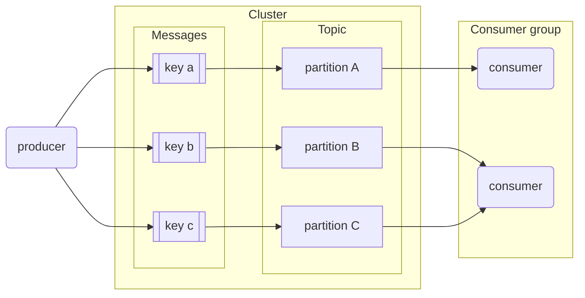

# Introduction to Streaming

# Introduction to Apache Kafka

## What is Kafka?

_[Video source](https://www.youtube.com/watch?v=P1u8x3ycqvg&list=PL3MmuxUbc_hJed7dXYoJw8DoCuVHhGEQb&index=57)_

[Apache Kafka](https://kafka.apache.org/) is a ***message broker*** and ***stream processor***. Kafka is used to handle ***real-time data feeds***.

Kafka is used to upgrade from a project architecture like this...


...to an architecture like this:


In a data project we can differentiate between _consumers_ and _producers_:
* ***Consumers*** are those that consume the data: web pages, micro services, apps, etc.
* ***Producers*** are those who supply the data to consumers.

Connecting consumers to producers directly can lead to an amorphous and hard to maintain architecture in complex projects like the one in the first image. Kafka solves this issue by becoming an intermediary that all other components connect to.

Kafka works by allowing producers to send ***messages*** which are then pushed in real time by Kafka to consumers.

Kafka is hugely popular and most technology-related companies use it.

_You can also check out [this animated comic](https://www.gentlydownthe.stream/) to learn more about Kafka._

## Basic Kafka components

_[Video source](https://www.youtube.com/watch?v=P1u8x3ycqvg&list=PL3MmuxUbc_hJed7dXYoJw8DoCuVHhGEQb&index=57)_

### Message

The basic communication abstraction used by producers and consumers in order to share information in Kafka is called a ***message***.

Messages have 3 main components:
* ***Key***: used to identify the message and for additional Kafka stuff such as partitions (covered later).
* ***Value***: the actual information that producers push and consumers are interested in.
* ***Timestamp***: used for logging.

### Topic

A ***topic*** is an abstraction of a concept. Concepts can be anything that makes sense in the context of the project, such as "sales data", "new members", "clicks on banner", etc.

A producer pushes a message to a topic, which is then consumed by a consumer subscribed to that topic.

### Broker and Cluster

A ***Kafka broker*** is a machine (physical or virtualized) on which Kafka is running.

A ***Kafka cluster*** is a collection of brokers (nodes) working together.

### Logs

In Kafka, ***logs*** are _data segments_ present on a storage disk. In other words, they're _physical representations of data_.

Logs store messages in an ordered fashion. Kafka assigns a sequence ID in order to each new message and then stores it in logs.

### Intermission: visualizing the concepts so far

Here's how a producer and a consumer would talk to the same Kafka broker to send and receive messages.

* Producer sending messages to Kafka.
    ```mermaid
    flowchart LR
        p(producer)
        k{{kafka broker}}
        subgraph logs[logs for topic 'abc']
            m1[message 1]
            m2[message 2]
            m3[message 3]
        end
        p-->|1. Declare topic 'abc'|k
        p-->|2. Send messages 1,2,3|k
        k -->|3. Write messages 1,2,3|logs
        k-.->|4. ack|p
    ```
    1. The producer first declares the topic it wants to "talk about" to Kafka. In this example, the topic will be `abc`. Kafka will then assign a _physical location_ on the hard drive for that specific topic (the topic logs).
    1. The producer then sends messages to Kafka (in our example, messages 1, 2 and 3).
    1. Kafka assigns an ID to the messages and writes them to the logs.
    1. Kafka sends an acknowledgement to the producer, informing it that the messages were successfully sent and written.

* Consumer receiving messages
    * Broker and logs are the same as those in the first graph; the graph has been split in 2 for clarity.
    ```mermaid
    flowchart LR
        c(consumer)
        k{{kafka broker}}
        subgraph logs[logs for topic 'abc']
            m1[message 1]
            m2[message 2]
            m3[message 3]
        end
        c-->|1. Subscribe to topic 'abc|k
        k<-->|2. Check messages|logs
        k-->|3. Send unread messages|c
        c-.->|4. ack|k
    ```
    1. The consumer declares to Kafka that it wants to read from a particular topic. In our example, the topic is `abc`.
    1. Kafka checks the logs and figures out which messages for that topic have been read and which ones are unread.
    1. Kafka sends the unread messages to the consumer.
    1. The consumer sends an acknowledgement to Kafka, informint it that the messages were successfully received.

### `__consumer_offsets`

The workflows work fine for a single consumer but it omits how it keeps track of read messages. It also doesn't show what would happen if 2 or more consumers are consuming messages for the same topic.

***`__consumer_offsets`*** is a special topic that keeps track of messages read by each consumer and topic. In other words: _Kafka uses itself_ to keep track of what consumers do.

When a consumer reads messages and Kafka receives the ack, Kafka posts a message to `__consumer_offsets` with the consumer ID, the topic and the message IDs that the consumer has read. If the consumer dies and spawns again, Kafka will know the last message delivered to it in order to resume sending new ones. If multiple consumers are present, Kafka knows which consumers have read which messages, so a message that has been read by consumer #1 but not by #2 can still be sent to #2.

### Consumer Groups

A ***consumer group*** is composed of multiple consumers.

In regards of controlling read messages, Kafka treats all the consumers inside a consumer group as a _single entity_: when a consumer inside a group reads a message, that message will ***NOT*** be delivered to any other consumer in the group.

Consumer groups allow consumer apps to scale independently: a consumer app made of multiple consumer nodes will not have to deal with duplicated or redundant messages.

Consumer groups have IDs and all consumers within a group have IDs as well.

The default value for consumer groups is 1. All consumers belong to a consumer group.

### Partitions

>Note: do not confuse BigQuery or Spark partitions with Kafka partitions; they are different concepts.

Topic logs in Kafka can be ***partitioned***. A topic is essentially a _wrapper_ around at least 1 partition.

Partitions are assigned to consumers inside consumer groups:
* ***A partition*** is assigned to ***one consumer only***.
* ***One consumer*** may have ***multiple partitions*** assigned to it.
* If a consumer dies, the partition is reassigned to another consumer.
* Ideally there should be as many partitions as consumers in the consumer group.
    * If there are more partitions than consumers, some consumers will receive messages from multiple partitions.
    * If there are more consumers than partitions, the extra consumers will be idle with nothing to do.

Partitions in Kafka, along with consumer groups, are a scalability feature. Increasing the amount of partitions allows the consumer group to increase the amount of consumers in order to read messages at a faster rate. Partitions for one topic may be stored in separate Kafka brokers in our cluster as well.

Messages are assigned to partitions inside a topic by means of their ***key***: message keys are hashed and the hashes are then divided by the amount of partitions for that topic; the remainder of the division is determined to assign it to its partition. In other words: _hash modulo partition amount_.
* While it would be possible to store messages in different partitions in a round-robin way, this method would not keep track of the _message order_.
* Using keys for assigning messages to partitions has the risk of making some partitions bigger than others. For example, if the topic `client` makes use of client IDs as message keys and one client is much more active than the others, then the partition assigned to that client will grow more than the others. In practice however this is not an issue and the advantages outweight the cons.



### Replication

Partitions are ***replicated*** accross multiple brokers in the Kafka cluster as a fault tolerance precaution.

When a partition is replicated accross multiple brokers, one of the brokers becomes the ***leader*** for that specific partition. The leader handles the message and writes it to its partition log. The partition log is then replicated to other brokers, which contain ***replicas*** for that partition. Replica partitions should contain the same messages as leader partitions.

If a broker which contains a leader partition dies, another broker becomes the leader and picks up where the dead broker left off, thus guaranteeing that both producers and consumers can keep posting and reading messages.

We can define the _replication factor_ of partitions at topic level. A replication factor of 1 (no replicas) is undesirable, because if the leader broker dies, then the partition becomes unavailable to the whole system, which could be catastrophic in certain applications.

## Kafka configurations

_[Video source](https://www.youtube.com/watch?v=Erf1-d1nyMY&list=PL3MmuxUbc_hJed7dXYoJw8DoCuVHhGEQb&index=58)_

This section will cover different settings and properties accross Kafka actors.
### Topic configurations

* `retention.ms`: due to storage space limitations, messages can't be kept indefinitely. This setting specifies the amount of time (in milliseconds) that a specific topic log will be available before being deleted.
* `cleanup.policy`: when the `retention.ms` time is up, we may choose to `delete` or `compact` a topic log.
    * Compaction does not happen instantly; it's a batch job that takes time.
* `partition`: number of partitions.
    * The higher the amount, the more resources Kafka requires to handle them. Remember that partitions will be replicated across brokers; if a broker dies we could easily overload the cluster.
* `replication`: replication factor; number of times a partition will be replicated.

### Consumer configurations

* `offset`: sequence of message IDs which have been read by the consumer.
* `consumer.group.id`: ID for the consumer group. All consumers belonging to the same group contain the same `consumer.group.id`.
* `auto_offset_reset`: when a consumer subscribes to a pre-existing topic for the first time, Kafka needs to figure out which messages to send to the consumer.
    * If `auto_offset_reset` is set to `earliest`, all of the existing messages in the topic log will be sent to the consumer.
    * If `auto_offset_reset` is set to `latest`, existing old messages will be ignored and only new messages will be sent to the consumer.

### Producer configurations

* `acks`: behaviour policy for handling acknowledgement signals. It may be set to `0`, `1` or `all`.
    * `0`: "fire and forget". The producer will not wait for the leader or replica brokers to write messages to disk.
        * Fastest policy for the producer. Useful for time-sensitive applications which are not affected by missing a couple of messages every so often, such as log messages or monitoring messages.
    * `1`: the producer waits for the leader broker to write the messaage to disk.
        * If the message is processed by the leader broker but the broker inmediately dies and the message has not been replicated, the message is lost.
    * `all`: the producer waits for the leader and all replica brokers to write the message to disk.
        * Safest but slowest policy. Useful for data-sensitive applications which cannot afford to lose messages, but speed will have to be taken into account.

# Kafka install and demo

## Installing Kafka

_[Video source](https://www.youtube.com/watch?v=Erf1-d1nyMY&list=PL3MmuxUbc_hJed7dXYoJw8DoCuVHhGEQb&index=58)_

Install instructions for Kafka can be found in [the official website](https://kafka.apache.org/quickstart#quickstart_kafkaconnect).

Due to the complexity of managing a manual Kafka install, a docker-compose script is provided [in this link](../6_streaming/docker-compose.yml). The Docker images are provided by [Confluent](https://www.confluent.io/), a Kafka tool vendor. The script defines the following services:

* **[`zookeeper`](https://zookeeper.apache.org/)**: a centralized service for maintaining configuration info. Kafka uses it for maintaining metadata knowledge such as topic partitions, etc.
    * Zookeeper is being phased out as a dependency, but for easier deployment we will use it in the lesson.
* **`broker`**: the main service. A plethora of environment variables are provided for easier configuration.
    * The image for this service packages both Kafka and [Confluent Server](https://docs.confluent.io/platform/current/installation/migrate-confluent-server.html), a set of commercial components for Kafka.
* **`kafka-tools`**: a set of additional Kafka tools provided by [Confluent Community](https://www.confluent.io/community/#:~:text=Confluent%20proudly%20supports%20the%20community,Kafka%C2%AE%EF%B8%8F%2C%20and%20its%20ecosystems.). We will make use of this service later in the lesson.
* **`schema-registry`**: provides a serving layer for metadata. We will make use of this service later in the lesson. 
* **`control-center`**: a web-based Kafka GUI.
    * Kafka can be entirely used with command-line tools, but the GUI helps us visualize things.

Download the script to your work directory and start the deployment with `docker-compose up` . It may take several minutes to deploy on the first run. Check the status of the deployment with `docker ps` . Once the deployment is complete, access the control center GUI by browsing to `localhost:9021` .

## Demo - Setting up a producer and consumer

We will now create a demo of a Kafka system with a producer and a consumer and see how messages are created and consumed.

1. In the Control Center GUI, select the `Cluster 1` cluster and in the topic section, create a new `demo_1` topic with 2 partitions and default settings.
1. Copy the [`requirements.txt`](../6_streaming/requirements.txt) to your work folder and [create a Python virtual environment](https://gist.github.com/ziritrion/8024025672ea92b8bdeb320d6015aa0d). You will need to run all the following scripts in this environment.
1. Copy the [`producer.py`](../6_streaming/producer.py) script to your work folder. Edit it and make sure that the line `producer.send('demo_1', value=data)` (it should be line 12 on an unmodified file) is set to `demo_1`. Run the script and leave it running in a terminal.
    * This script registers to Kafka as a producer and sends a message each second until it sends 1000 messages.
    * With the script running, you should be able to see the messages in the Messages tab of the `demo_1` topic window in Control Center.
1. Copy the [`consumer.py`](../6_streaming/consumer.py) script to your work folder. Edit it and make sure that the first argument of `consumer = KafkaConsumer()` is `'demo_1',` (in an unmodified script this should be in line 6) and the `group_id` value should be `'consumer.group.id.demo.1'`
    * This script registers to Kafka as a consumer and continuously reads messages from the topic, one message each second.
1. Run the `consumer.py` script on a separate terminal from `producer.py`. You should see the consumer read the messages in sequential order. Kill the consumer and run it again to see how it resumes from the last read message.
1. With the `consumer.py` running, modify the script and change `group_id` to `'consumer.group.id.demo.2'`. Run the script on a separate terminal; you should now see how it consumes all messages starting from the beginning because `auto_offset_reset` is set to `earliest` and we now have 2 separate consumer groups accessing the same topic.
1. On yet another terminal, run the `consumer.py` script again. The consumer group `'consumer.group.id.demo.2'` should now have 2 consumers. If you check the terminals, you should now see how each consumer receives separate messages because the second consumer has been assigned a partition, so each consumer receives the messages for their partitions only.
1. Finally, run a 3rd consumer. You should see no activity for this consumer because the topic only has 2 partitions, so no partitions can be assigned to the idle consumer.

# Avro and Schema Registry

---

> Under construction

# Kafka Connect
# Kafka Streams
# What questions to ask?

