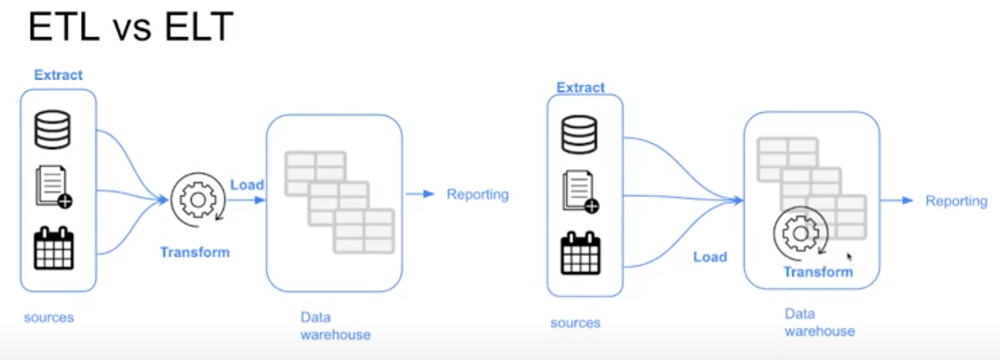
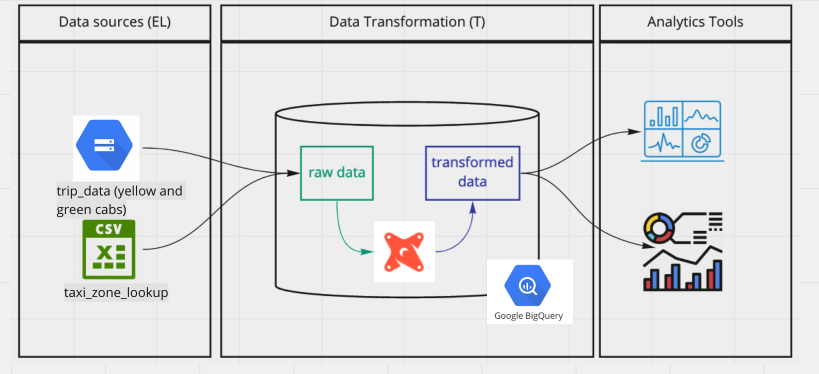
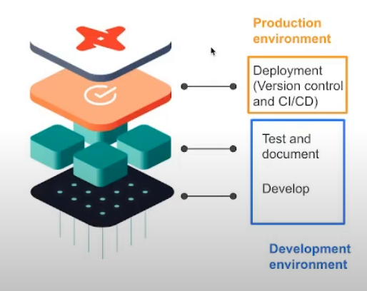
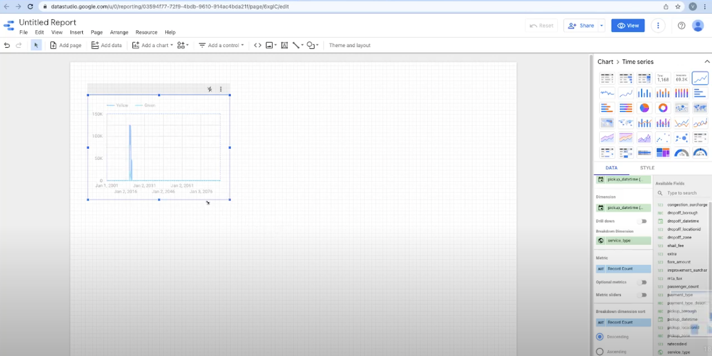
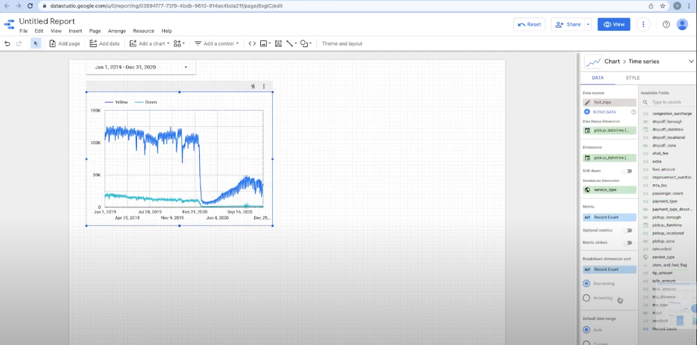

>Previous: [Data Warehouse](3_data_warehouse.md)

>[Back to index](README.md)

>Next: [Batch Processing](5_batch_processing.md)

>>Extra: [Preparing Data for Spark](extra1_preparing_data.md)

### Table of contents

- [Introduction to Analytics Engineering](#introduction-to-analytics-engineering)
  - [What is Analytics Engineering?](#what-is-analytics-engineering)
  - [Data Modeling Concepts](#data-modeling-concepts)
    - [ETL vs ELT](#etl-vs-elt)
    - [Dimensional Modeling](#dimensional-modeling)
- [Introduction to dbt](#introduction-to-dbt)
  - [What is dbt?](#what-is-dbt)
  - [How does dbt work?](#how-does-dbt-work)
  - [How to use dbt?](#how-to-use-dbt)
- [Setting up dbt](#setting-up-dbt)
  - [dbt Cloud](#dbt-cloud)
  - [dbt Core](#dbt-core)
- [Developing with dbt](#developing-with-dbt)
  - [Anatomy of a dbt model](#anatomy-of-a-dbt-model)
  - [The FROM clause](#the-from-clause)
  - [Defining a source and creating a model](#defining-a-source-and-creating-a-model)
  - [Macros](#macros)
  - [Packages](#packages)
  - [Variables](#variables)
  - [Referencing older models in new models](#referencing-older-models-in-new-models)
- [Testing and documenting dbt models](#testing-and-documenting-dbt-models)
  - [Testing](#testing)
  - [Documentation](#documentation)
- [Deployment of a dbt project](#deployment-of-a-dbt-project)
  - [Deployment basics](#deployment-basics)
  - [Continuous Integration](#continuous-integration)
  - [Deployment using dbt Cloud](#deployment-using-dbt-cloud)
  - [Deployment using dbt Core (local)](#deployment-using-dbt-core-local)
- [Data visualization](#data-visualization)
  - [Google Data Studio](#google-data-studio)
  - [Metabase](#metabase)

# Introduction to Analytics Engineering

_[Video source](https://www.youtube.com/watch?v=uF76d5EmdtU&list=PL3MmuxUbc_hJed7dXYoJw8DoCuVHhGEQb&index=34)_

## What is Analytics Engineering?

As the _data domain_ has developed over time, new tools have been introduced that have changed the dynamics of working with data:

1. Massively parallel processing (MPP) databases
    * Lower the cost of storage 
    * BigQuery, Snowflake, Redshift...
1. Data-pipelines-as-a-service
    * Simplify the ETL process
    * Fivetran, Stitch...
1. SQL-first / Version control systems
    * Looker...
1. Self service analytics
    * Mode...
1. Data governance

The introduction of all of these tools changed the way the data teams work as well as the way that the stakeholders consume the data, creating a gap in the roles of the data team. Traditionally:

* The ***data engineer*** prepares and maintains the infrastructure the data team needs.
* The ***data analyst*** uses data to answer questions and solve problems (they are in charge of _today_).
* The ***data scientist*** predicts the future based on past patterns and covers the what-ifs rather than the day-to-day (they are in charge of _tomorrow_).

However, with the introduction of these tools, both data scientists and analysts find themselves writing more code even though they're not software engineers and writing code isn't their top priority.  Data engineers are good software engineers but they don't have the training in how the data is going to be used  by the business users.

The ***analytics engineer*** is the role that tries to fill the gap: it introduces the good software engineering practices to the efforts of data analysts and data scientists. The analytics engineer may be exposed to the following tools:
1. Data Loading (Stitch...)
1. Data Storing (Data Warehouses)
1. Data Modeling (dbt, Dataform...)
1. Data Presentation (BI tools like Looker, Mode, Tableau...)

This lesson focuses on the last 2 parts: Data Modeling and Data Presentation.

## Data Modeling Concepts

### ETL vs ELT

In lesson 2 we covered the difference between [ETL and ELT](2_data_ingestion.md#etl-vs-elt).



In this lesson we will cover the _transform_ step in the ELT process.

### Dimensional Modeling

[Ralph Kimball's Dimensional Modeling](https://www.wikiwand.com/en/Dimensional_modeling#:~:text=Dimensional%20modeling%20(DM)%20is%20part,use%20in%20data%20warehouse%20design.) is an approach to Data Warehouse design which focuses on 2 main points:
* Deliver data which is understandable to the business users.
* Deliver fast query performance.

Other goals such as reducing redundant data (prioritized by other approaches such as [3NF](https://www.wikiwand.com/en/Third_normal_form#:~:text=Third%20normal%20form%20(3NF)%20is,integrity%2C%20and%20simplify%20data%20management.) by [Bill Inmon](https://www.wikiwand.com/en/Bill_Inmon)) are secondary to these goals. Dimensional Modeling also differs from other approaches to Data Warehouse design such as [Data Vaults](https://www.wikiwand.com/en/Data_vault_modeling).

Dimensional Modeling is based around 2 important concepts:
* ***Fact Table***:
    * _Facts_ = _Measures_
    * Typically numeric values which can be aggregated, such as measurements or metrics.
        * Examples: sales, orders, etc.
    * Corresponds to a [_business process_ ](https://www.wikiwand.com/en/Business_process).
    * Can be thought of as _"verbs"_.
* ***Dimension Table***:
    * _Dimension_ = _Context_
    * Groups of hierarchies and descriptors that define the facts.
        * Example: customer, product, etc.
    * Corresponds to a _business entity_.
    * Can be thought of as _"nouns"_.
* Dimensional Modeling is built on a [***star schema***](https://www.wikiwand.com/en/Star_schema) with fact tables surrounded by dimension tables.

A good way to understand the _architecture_ of Dimensional Modeling is by drawing an analogy between dimensional modeling and a restaurant:
* Stage Area:
    * Contains the raw data.
    * Not meant to be exposed to everyone.
    * Similar to the food storage area in a restaurant.
* Processing area:
    * From raw data to data models.
    * Focuses in efficiency and ensuring standards.
    * Similar to the kitchen in a restaurant.
* Presentation area:
    * Final presentation of the data.
    * Exposure to business stakeholder.
    * Similar to the dining room in a restaurant.

_[Back to the top](#)_

# Introduction to dbt

_[Video source](https://www.youtube.com/watch?v=4eCouvVOJUw&list=PL3MmuxUbc_hJed7dXYoJw8DoCuVHhGEQb&index=35)_

## What is dbt?

***dbt*** stands for ***data build tool***. It's a _transformation_ tool: it allows us to transform process _raw_ data in our Data Warehouse to _transformed_ data which can be later used by Business Intelligence tools and any other data consumers.

dbt also allows us to introduce good software engineering practices by defining a _deployment workflow_:
1. Develop models
1. Test and document models
1. Deploy models with _version control_ and _CI/CD_.

## How does dbt work?

dbt works by defining a ***modeling layer*** that sits on top of our Data Warehouse. The modeling layer will turn _tables_ into ***models*** which we will then transform into _derived models_, which can be then stored into the Data Warehouse for persistence.

A ***model*** is a .sql file with a `SELECT` statement; no DDL or DML is used. dbt will compile the file and run it in our Data Warehouse.

## How to use dbt?

dbt has 2 main components: _dbt Core_ and _dbt Cloud_:
* ***dbt Core***: open-source project that allows the data transformation.
    * Builds and runs a dbt project (.sql and .yaml files).
    * Includes SQL compilation logic, macros and database adapters.
    * Includes a CLI interface to run dbt commands locally.
    * Open-source and free to use.
* ***dbt Cloud***: SaaS application to develop and manage dbt projects.
    * Web-based IDE to develop, run and test a dbt project.
    * Jobs orchestration.
    * Logging and alerting.
    * Intregrated documentation.
    * Free for individuals (one developer seat).

For integration with BigQuery we will use the dbt Cloud IDE, so a local installation of dbt core isn't required. For developing locally rather than using the Cloud IDE, dbt Core is required. Using dbt with a local Postgres database can be done with dbt Core, which can be installed locally and connected to Postgres and run models through the CLI.



# Setting up dbt

Before we begin, go to BigQuery and create 2 new empty datasets for your project: a _development_ dataset and a _production_ dataset. Name them any way you'd like.

## dbt Cloud

_[Video source](https://www.youtube.com/watch?v=iMxh6s_wL4Q&list=PL3MmuxUbc_hJed7dXYoJw8DoCuVHhGEQb&index=36)_

In order to use dbt Cloud you will need to create a user account. Got to the [dbt homepage](https://www.getdbt.com/) and sign up.

During the sign up process you will be asked to create a starter project and connect to a database. We will connect dbt to BigQuery using [BigQuery OAuth](https://docs.getdbt.com/docs/dbt-cloud/cloud-configuring-dbt-cloud/cloud-setting-up-bigquery-oauth). More detailed instructions on how to generate the credentials and connect both services are available [in this link](https://github.com/DataTalksClub/data-engineering-zoomcamp/blob/main/week_4_analytics_engineering/dbt_cloud_setup.md). When asked, connnect the project to your _development_ dataset.

Make sure that you set up a GitHub repo for your project. In _Account settings_ > _Projects_ you can select your project and change its settings, such as _Name_ or _dbt Project Subdirectoy_, which can be convenient if your repo is previously populated and would like to keep the dbt project in a single subfolder.

In the IDE windows, press the green _Initilize_ button to create the project files. Inside `dbt_project.yml`, change the project name both in the `name` field as well as right below the `models:` block. You may comment or delete the `example` block at the end.

## dbt Core

_[Video source](https://www.youtube.com/watch?v=1HmL63e-vRs&list=PL3MmuxUbc_hJed7dXYoJw8DoCuVHhGEQb&index=37)_

Installing dbt Core locally can be done following the steps in [the official docs](https://docs.getdbt.com/dbt-cli/install/overview). More instructions are also available [in this link](https://github.com/DataTalksClub/data-engineering-zoomcamp/tree/main/week_4_analytics_engineering/docker_setup).

Starting a dbt project with dbt Core involves creating a `profiles.yml` file manually before running `dbt init`. Check the Video source for more info.

_[Back to the top](#)_

# Developing with dbt

_[Video source](https://www.youtube.com/watch?v=UVI30Vxzd6c&list=PL3MmuxUbc_hJed7dXYoJw8DoCuVHhGEQb&index=38)_

## Anatomy of a dbt model

dbt models are mostly written in SQL (remember that a dbt model is essentially a `SELECT` query) but they also make use of the [Jinja templating language](https://jinja.palletsprojects.com/en/3.0.x/) for templates. We already covered the basics of Jinja templates in [lesson 2](2_data_ingestion.md#airflow-and-dag-tips-and-tricks).

Here's an example dbt model:

```sql
{{
    config(materialized='table')
}}

SELECT *
FROM staging.source_table
WHERE record_state = 'ACTIVE'
```

* In the Jinja statement defined within the `{{ }}` block we call the [`config()` function](https://docs.getdbt.com/reference/dbt-jinja-functions/config).
    * More info about Jinja macros for dbt [in this link](https://docs.getdbt.com/docs/building-a-dbt-project/jinja-macros).
* We commonly use the `config()` function at the beginning of a model to define a ***materialization strategy***: a strategy for persisting dbt models in a warehouse.
    * The `table` strategy means that the model will be rebuilt as a table on each run.
    * We could use a `view` strategy instead, which would rebuild the model on each run as a SQL view.
    * The `incremental` strategy is essentially a `table` strategy but it allows us to add or update records incrementally rather than rebuilding the complete table on each run.
    * The `ephemeral` strategy creates a _[Common Table Expression](https://www.essentialsql.com/introduction-common-table-expressions-ctes/)_ (CTE).
    * You can learn more about materialization strategies with dbt [in this link](https://docs.getdbt.com/docs/building-a-dbt-project/building-models/materializations). Besides the 4 common `table`, `view`, `incremental` and `ephemeral` strategies, custom strategies can be defined for advanced cases.

dbt will compile this code into the following SQL query:

```sql
CREATE TABLE my_schema.my_model AS (
    SELECT *
    FROM staging.source_table
    WHERE record_state = 'ACTIVE'
)
```

After the code is compiled, dbt will run the compiled code in the Data Warehouse.

Additional model properties are stored in YAML files. Traditionally, these files were named `schema.yml` but later versions of dbt do not enforce this as it could lead to confusion.

## The FROM clause

The `FROM` clause within a `SELECT` statement defines the _sources_ of the data to be used.

The following sources are available to dbt models:

* ***Sources***: The data loaded within our Data Warehouse.
    * We can access this data with the `source()` function.
    * The `sources` key in our YAML file contains the details of the databases that the `source()` function can access and translate into proper SQL-valid names.
        * Additionally, we can define "source freshness" to each source so that we can check whether a source is "fresh" or "stale", which can be useful to check whether our data pipelines are working properly.
    * More info about sources [in this link](https://docs.getdbt.com/docs/building-a-dbt-project/using-sources).
* ***Seeds***: CSV files which can be stored in our repo under the `seeds` folder.
    * The repo gives us version controlling along with all of its benefits.
    * Seeds are best suited to static data which changes infrequently.
    * Seed usage:
        1. Add a CSV file to your `seeds` folder.
        1. Run the [`dbt seed` command](https://docs.getdbt.com/reference/commands/seed) to create a table in our Data Warehouse.
            * If you update the content of a seed, running `dbt seed` will append the updated values to the table rather than substituing them. Running `dbt seed --full-refresh` instead will drop the old table and create a new one.
        1. Refer to the seed in your model with the `ref()` function.
    * More info about seeds [in this link](https://docs.getdbt.com/docs/building-a-dbt-project/seeds).

Here's an example of how you would declare a source in a `.yml` file:

```yaml
sources:
    - name: staging
      database: production
      schema: trips_data_all

      loaded_at_field: record_loaded_at
      tables:
        - name: green_tripdata
        - name: yellow_tripdata
          freshness:
            error_after: {count: 6, period: hour}
```

And here's how you would reference a source in a `FROM` clause:

```sql
FROM {{ source('staging','yellow_tripdata') }}
```
* The first argument of the `source()` function is the source name, and the second is the table name.

In the case of seeds, assuming you've got a `taxi_zone_lookup.csv` file in your `seeds` folder which contains `locationid`, `borough`, `zone` and `service_zone`:

```sql
SELECT
    locationid,
    borough,
    zone,
    replace(service_zone, 'Boro', 'Green') as service_zone
FROM {{ ref('taxi_zone_lookup) }}
```

The `ref()` function references underlying tables and views in the Data Warehouse. When compiled, it will automatically build the dependencies and resolve the correct schema fo us. So, if BigQuery contains a schema/dataset called `dbt_dev` inside the `my_project` database which we're using for development and it contains a table called `stg_green_tripdata`, then the following code...

```sql
WITH green_data AS (
    SELECT *,
        'Green' AS service_type
    FROM {{ ref('stg_green_tripdata') }}
),
```

...will compile to this:

```sql
WITH green_data AS (
    SELECT *,
        'Green' AS service_type
    FROM "my_project"."dbt_dev"."stg_green_tripdata"
),
```
* The `ref()` function translates our references table into the full reference, using the `database.schema.table` structure.
* If we were to run this code in our production environment, dbt would automatically resolve the reference to make ir point to our production schema.

## Defining a source and creating a model

We will now create our first model.

We will begin by creating 2 new folders under our `models` folder:
* `staging` will have the raw models.
* `core` will have the models that we will expose at the end to the BI tool, stakeholders, etc.

Under `staging` we will add 2 new files: `sgt_green_tripdata.sql` and `schema.yml`:
```yaml
# schema.yml

version: 2

sources:
    - name: staging
      database: your_project
      schema: trips_data_all

      tables:
          - name: green_tripdata
          - name: yellow_tripdata
```
* We define our ***sources*** in the `schema.yml` model properties file.
* We are defining the 2 tables for yellow and green taxi data as our sources.
```sql
-- sgt_green_tripdata.sql

{{ config(materialized='view') }}

select * from {{ source('staging', 'green_tripdata') }}
limit 100
```
* This query will create a ***view*** in the `staging` dataset/schema in our database.
* We make use of the `source()` function to access the green taxi data table, which is defined inside the `schema.yml` file.

The advantage of having the properties in a separate file is that we can easily modify the `schema.yml` file to change the database details and write to different databases without having to modify our `sgt_green_tripdata.sql` file.

You may know run the model with the `dbt run` command, either locally or from dbt Cloud.

## Macros

***Macros*** are pieces of code in Jinja that can be reused, similar to functions in other languages.

dbt already includes a series of macros like `config()`, `source()` and `ref()`, but custom macros can also be defined.

Macros allow us to add features to SQL that aren't otherwise available, such as:
* Use control structures such as `if` statements or `for` loops.
* Use environment variables in our dbt project for production.
* Operate on the results of one query to generate another query.
* Abstract snippets of SQL into reusable macros.

Macros are defined in separate `.sql` files which are typically stored in a `macros` directory.

There are 3 kinds of Jinja _delimiters_:
* `` for ***statements*** (control blocks, macro definitions)
* `{{ ... }}` for ***expressions*** (literals, math, comparisons, logic, macro calls...)
* `{# ... #}` for comments.

Here's a macro definition example:

```sql
{# This macro returns the description of the payment_type #}



    case {{ payment_type }}
        when 1 then 'Credit card'
        when 2 then 'Cash'
        when 3 then 'No charge'
        when 4 then 'Dispute'
        when 5 then 'Unknown'
        when 6 then 'Voided trip'
    end


```
* The `macro` keyword states that the line is a macro definition. It includes the name of the macro as well as the parameters.
* The code of the macro itself goes between 2 statement delimiters. The second statement delimiter contains an `endmacro` keyword.
* In the code, we can access the macro parameters using expression delimiters.
* The macro returns the ***code*** we've defined rather than a specific value.

Here's how we use the macro:
```sql
select
    {{ get_payment_type_description('payment-type') }} as payment_type_description,
    congestion_surcharge::double precision
from {{ source('staging','green_tripdata') }}
where vendorid is not null
```
* We pass a `payment-type` variable which may be an integer from 1 to 6.

And this is what it would compile to:
```sql
select
    case payment_type
        when 1 then 'Credit card'
        when 2 then 'Cash'
        when 3 then 'No charge'
        when 4 then 'Dispute'
        when 5 then 'Unknown'
        when 6 then 'Voided trip'
    end as payment_type_description,
    congestion_surcharge::double precision
from {{ source('staging','green_tripdata') }}
where vendorid is not null
```
* The macro is replaced by the code contained within the macro definition as well as any variables that we may have passed to the macro parameters.

## Packages

Macros can be exported to ***packages***, similarly to how classes and functions can be exported to libraries in other languages. Packages contain standalone dbt projects with models and macros that tackle a specific problem area.

When you add a package to your project, the package's models and macros become part of your own project. A list of useful packages can be found in the [dbt package hub](https://hub.getdbt.com/).

To use a package, you must first create a `packages.yml` file in the root of your work directory. Here's an example:
```yaml
packages:
  - package: dbt-labs/dbt_utils
    version: 0.8.0
```

After declaring your packages, you need to install them by running the `dbt deps` command either locally or on dbt Cloud.

You may access macros inside a package in a similar way to how Python access class methods:
```sql
select
    {{ dbt_utils.surrogate_key(['vendorid', 'lpep_pickup_datetime']) }} as tripid,
    cast(vendorid as integer) as vendorid,
    -- ...
```
* The `surrogate_key()` macro generates a hashed [surrogate key](https://www.geeksforgeeks.org/surrogate-key-in-dbms/) with the specified fields in the arguments.

## Variables

Like most other programming languages, ***variables*** can be defined and used across our project.

Variables can be defined in 2 different ways:
* Under the `vars` keyword inside `dbt_project.yml`.
    ```yaml
    vars:
        payment_type_values: [1, 2, 3, 4, 5, 6]
    ```
* As arguments when building or running your project.
    ```sh
    dbt build --m <your-model.sql> --var 'is_test_run: false'
    ```

Variables can be used with the `var()` macro. For example:
```sql


    limit 100


```
* In this example, the default value for `is_test_run` is `true`; in the absence of a variable definition either on the `dbt_project.yml` file or when running the project, then `is_test_run` would be `true`.
* Since we passed the value `false` when runnning `dbt build`, then the `if` statement would evaluate to `false` and the code within would not run.

## Referencing older models in new models

>Note: you will need the [Taxi Zone Lookup Table seed](https://s3.amazonaws.com/nyc-tlc/misc/taxi+_zone_lookup.csv), the [staging models and schema](https://github.com/DataTalksClub/data-engineering-zoomcamp/tree/main/week_4_analytics_engineering/taxi_rides_ny/models/staging) and the [macro files](https://github.com/DataTalksClub/data-engineering-zoomcamp/tree/main/week_4_analytics_engineering/taxi_rides_ny/macros) for this section.

The models we've created in the _staging area_ are for normalizing the fields of both green and yellow taxis. With normalized field names we can now join the 2 together in more complex ways.

The `ref()` macro is used for referencing any undedrlying tables and views that we've created, so we can reference seeds as well as models using this macro:

```sql
{{ config(materialized='table') }}

select
    locationid,
    borough,
    zone,
    replace(service_zone, 'Boro', 'Green') as service_zone
from {{ ref('taxi_zone_lookup') }}
```
* This model references the `taxi_zone_lookup` table created from the taxi zone lookup CSV seed.

```sql
with green_data as (
    select *, 
        'Green' as service_type 
    from {{ ref('stg_green_tripdata') }}
), 
```
* This snippet references the `sgt_green_tripdata` model that we've created before. Since a model outputs a table/view, we can use it in the `FROM` clause of any query.

You may check out these more complex "core" models [in this link](https://github.com/DataTalksClub/data-engineering-zoomcamp/tree/main/week_4_analytics_engineering/taxi_rides_ny/models/core).

>Note: running `dbt run` will run all models but NOT the seeds. The `dbt build` can be used instead to run all seeds and models as well as tests, which we will cover later. Additionally, running `dbt run --select my_model` will only run the model itself, but running `dbt run --select +my_model` will run the model as well as all of its dependencies.

_[Back to the top](#)_

# Testing and documenting dbt models

Testing and documenting are not required steps to successfully run models, but they are expected in any professional setting.

## Testing

Tests in dbt are ***assumptions*** that we make about our data.

In dbt, tests are essentially a `SELECT` query that will return the amount of records that fail because they do not follow the assumption defined by the test.

Tests are defined on a column in the model YAML files (like the `schema.yml` file we defined before). dbt provides a few predefined tests to check column values but custom tests can also be created as queries. Here's an example test:

```yaml
models:
  - name: stg_yellow_tripdata
    description: >
        Trips made by New York City's iconic yellow taxis. 
    columns:
        - name: tripid
        description: Primary key for this table, generated with a concatenation of vendorid+pickup_datetime
        tests:
            - unique:
                severity: warn
            - not_null:
                severrity: warn
```
* The tests are defined for a column in a specific table for a specific model.
* There are 2 tests in this YAML file: `unique` and `not_null`. Both are predefined by dbt.
* `unique` checks whether all the values in the `tripid` column are unique.
* `not_null` checks whether all the values in the `tripid` column are not null.
* Both tests will return a warning in the command line interface if they detect an error.

Here's wwhat the `not_null` will compile to in SQL query form:

```sql
select *
from "my_project"."dbt_dev"."stg_yellow_tripdata"
```

You may run tests with the `dbt test` command.

## Documentation

dbt also provides a way to generate documentation for your dbt project and render it as a website.

You may have noticed in the previous code block that a `description:` field can be added to the YAML field. dbt will make use of these fields to gather info.

The dbt generated docs will include the following:
* Information about the project:
    * Model code (both from the .sql files and compiled code)
    * Model dependencies
    * Sources
    * Auto generated DAGs from the `ref()` and `source()` macros
    * Descriptions from the .yml files and tests
* Information about the Data Warehouse (`information_schema`):
    * Column names and data types
    * Table stats like size and rows

dbt docs can be generated on the cloud or locally with `dbt docs generate`, and can be hosted in dbt Cloud as well or on any other webserver with `dbt docs serve`.

_[Back to the top](#)_

# Deployment of a dbt project

_Video sources: [1](https://www.youtube.com/watch?v=rjf6yZNGX8I&list=PL3MmuxUbc_hJed7dXYoJw8DoCuVHhGEQb&index=40)_, [2](https://www.youtube.com/watch?v=Cs9Od1pcrzM&list=PL3MmuxUbc_hJed7dXYoJw8DoCuVHhGEQb&index=41)

## Deployment basics

If you remember from the [beginning of this lesson](#what-is-dbt), the goal of dbt is to introduce good software engineering practices by defining a ***deployment workflow***.



So far we've seen the Developt and Test And Document stages of the workflow. We will now cover ***deployment***.

***Deployment*** is the process of running the models we created in our development environment in a ***production environment***. Separating the development and production environments allows us to continue building and testing models without affecting the models in production.

Normally, a production environment will have a different schema in our Data Warehouse and ideally a different user.

The ***deployment workflow*** defines the steps used to create a model from scratch and bring it to production. Here's a deployment workflow example:
1. Develop in a user branch.
1. Open a PR to merge into the main branch.
1. Merge the user branch to the main branch.
1. Run the new models in the production environment using the main branch.
1. Schedule the models.

dbt projects are usually deployed in the form of ***jobs***:
* A ***job*** is a collection of _commands_ such as `build` or `test`. A job may contain one or more commands.
* Jobs can be triggered manually or on schedule.
    * dbt Cloud has a scheduler which can run jobs for us, but other tools such as Airflow or cron can be used as well.
* Each job will keep a log of the runs over time, and each run will keep the logs for each command.
* A job may also be used to generate documentation, which may be viewed under the run information.
* If the `dbt source freshness` command was run, the results can also be viewed at the end of a job.

## Continuous Integration

Another good software engineering practice that dbt enables is ***Continuous Integration*** (CI): the practice of regularly merging development branches into a central repository, after which automated builds and tests are run. The goal of CI is to reduce adding bugs to the production code and maintain a more stable project.

CI is built on jobs: a CI job will do things such as build, test, etc. We can define CI jobs which can then be triggered under certain circunstances to enable CI.

dbt makes use of GitHub/GitLab's Pull Requests to enable CI via [webhooks](https://www.wikiwand.com/en/Webhook). When a PR is ready to be merged, a webhook is received in dbt Cloud that will enqueue a new run of a CI job. This run will usually be against a temporary schema that has been created explicitly for the PR. If the job finishes successfully, the PR can be merged into the main branch, but if it fails the merge will not happen.

CI jobs can also be scheduled with the dbt Cloud scheduler, Airflow, cron and a number of additional tools.

## Deployment using dbt Cloud

In dbt Cloud, you might have noticed that after the first commit, the `main` branch becomes read-only and forces us to create a new branch if we want to keep developing. dbt Cloud does this to enforce us to open PRs for CI purposes rather than allowing merging to `main` straight away.

In order to properly establish a deployment workflow, we must define ***environments*** within dbt Cloud. In the sidebar, under _Environments_, you will see that a default _Development_ environment is already generated, which is the one we've been using so far.

We will create a new _Production_ environment of type _Deployment_ using the latest stable dbt version (`v1.0` at the time of writing these notes). By default, the environment will use the `main` branch of the repo but you may change it for more complex workflows. If you used the JSON credentials when setting up dbt Cloud then most of the deployment credentials should already be set up except for the dataset. For this example, we will use the `production` dataset (make sure that the `production` dataset/schema exists in your BigQuery project).

The dbt Cloud scheduler is available in the _Jobs_ menu in the sidebar. We will create a new job with name `dbt build` using the _Production_ environment, we will check the _Generate docs?_ checkbox. Add the following commands:

1. `dbt seed`
1. `dbt run`
1. `dbt test`

In the _Schedule_ tab at the bottom we will check the _Run on schedule?_ checkbox with a timing of _Every day_ and _every 6 hours_. Save the job. You will be shown the job's run history screen which contains a _Run now_ buttom that allows us to trigger the job manually; do so to check that the job runs successfully.

You can access the run and check the current state of it as well as the logs. After the run is finished, you will see a _View Documentation_ button at the top; clicking on it will open a new browser window/tab with the generated docs.

Under _Account settings_ > _Projects_, you may edit the project in order to modify the _Documentation_ field under _Artifacts_; you should see a drop down menu which should contain the job we created which generates the docs. After saving the changes and reloading the dbt Cloud website, you should now have a _Documentation_ section in the sidebar.

## Deployment using dbt Core (local)

In dbt Core, environments are defined in the `profiles.yml` file. Assuming you've defined a ***target*** (an environment) called `prod`, you may build your project agains it using the `dbt build -t prod` command.

You may learn more about how to set up the `profiles.yml` file [in this link](https://docs.getdbt.com/dbt-cli/configure-your-profile).

_[Back to the top](#)_

# Data visualization

_Video sources: [1](https://www.youtube.com/watch?v=39nLTs74A3E&list=PL3MmuxUbc_hJed7dXYoJw8DoCuVHhGEQb&index=42)_, [2](https://www.youtube.com/watch?v=BnLkrA7a6gM&list=PL3MmuxUbc_hJed7dXYoJw8DoCuVHhGEQb&index=43)

After creating our models, transforming the data and deploying the models, we will now ***visualize*** the data.

## Google Data Studio

[Google Data Studio](https://datastudio.google.com/) (GDS) is an online tool for converting data into ***reports*** and ***dashboards***.

In first place we will create a ***Data Source***. GDS supports multiple sources including BigQuery. After authorizing GDS to access BigQuery, we will be able to select our project and datasets. We will connect to our `production.fact_trips` schema.

After creating the data source, a new window will open with the _dimensions_ (table columns), the type of each dimension and the default aggregation for each dimension. You may change the default aggregation as you see fit for each dimension.

A ***Report*** is essentially an empty canvas which can be filled with can be filled with different widgets. The widgets that display data are called ***Charts***; widgets that modify the behavior of other charts are called ***Controls***. There are additional widgets for text, images and other elements to help improve the looks and readability of the report.

We will now create a new report by clicking on the _Create report_ button at the top of the Data Source window. A new window will open which will allow us to design our own custom report. An example table is already provided but you may delete it because we will be creating our own from scratch.

Add the first widget to the report. We want to show the amount of trips per day, so we'll choose a _Time Series Chart_. GDS will pick up the most likely dimensions for the chart, which for `fact_trips` happens to be `pickup_datetime`, but we need to add an additional dimension for breaking down the data, so we will drag an drop `service_type` into the widget sidebar, which should update with 2 lines, one for yellow taxi and another one for green taxi data. You may also move and resize the chart.



You may notice that the vast majority of trips are concentrated in a small interval; this is due to dirty data which has bogus values for `pickup_datetime`. We can filter out these bogus values by adding a _Date Range Control_, which we can drag and drop anywhere in the report, and then set the start date to January 1st 2019 and the end date to December 31st 2020.



>Note: Controls affect all the Charts in the report.

Clicking on a chart will open the chart's sidebar with 2 tabs: the _Data_ tab contains all the specifics of the data to be displayed and the _Style_ tab allows us to change the appearance of the chart.

You may also add a text widget as a title for the chart.

We will now add a _Scorecard With Compact Numbers_ with the total record count in `fact_trips`, a _Pie chart_ displaying the `service_type` dimension using the record count metric and a _Table With Heatmap_ using `pickup_zone` as its dimension.

We will also add a _Stacked Column Bar_ showing trips per month. Since we do not have that particular dimension, what we can do instead is to create a new field that will allow us to filter by month:
1. In the _Available Fields_ sidebar, click on _Add a field_ at the bottom.
1. Name the new field `pickup_month`.
1. In the _Formula_ field, type `MONTH(pickup_datetime)`.
1. Click on _Save_ and then on _Done_.
1. Back in the main page, drag the new `pickup_month` field from the _Available fields_ sidebar to the _Dimension_ field in the _Data_ sidebar. Get rid of all breakdown dimensions.

Our bar chart will now display trips per month but we still want to discriminate by year:

1. Add a new field and name it `pickup_year`.
1. Type in the formula `YEAR(pickup_datetime)`.
1. Click on _Save_ and _Done_.
1. Add the `pickup_year` field as a breakdown dimension for the bar chart.
1. Change the _Sort_ dimension to `pickup_month` and make it ascending.

Finally, we will add a _Drop-Down List Control_ and drag the `service_type` dimension to _Control field_. The drop-down control will now allow us to choose yellow, green or both taxi types. We will also rename the report to _Trips analysis years 2019-2020_.


You may click on the _View_ button at the top to check how the shared report will look to the stakeholders. Sharing the report works similarly to Google Drive document sharing.

## Metabase

GDS cannot be used for local databases. If you're developing locally, you may use the [Open Source Edition](https://www.metabase.com/start/oss/) of [Metabase](https://www.metabase.com/).

You may run Metabase on Docker or running a local JAR file. The main UI is a website for which a username and a database connection must be provided.

In Metabase, charts are called ***questions***. Questions have 3 components:
* ***Data***: the data we will use for the question. Multiple data sources can be configured as well as custom columns that allow us to apply formulas to regular columns.
* ***Filters***: reduces the amount of records to use in the question by defining criteria for qualification, such as specific time periods.
* ***Summarize***: contains predefined aggregations and formulas to manipulate the results, such as counting records by specific dates. Custom summarization formulas can also be defined.

Once the 3 components have been defined, a preview will be shown. Once you're ready, you may click the _Visualize_ button to generate the chart.

Questions can be saved in _collections_ and displayed in _dashboards_.

_[Back to the top](#)_

>Previous: [Data Warehouse](3_data_warehouse.md)

>[Back to index](README.md)

>Next: [Batch Processing](5_batch_processing.md)

>>Extra: [Preparing Data for Spark](extra1_preparing_data.md)