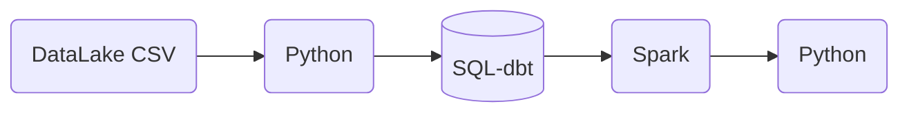
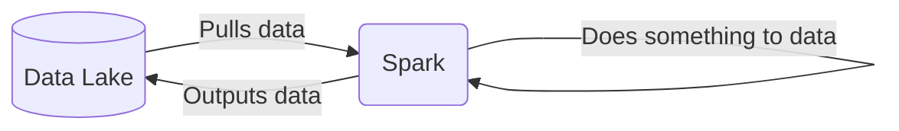
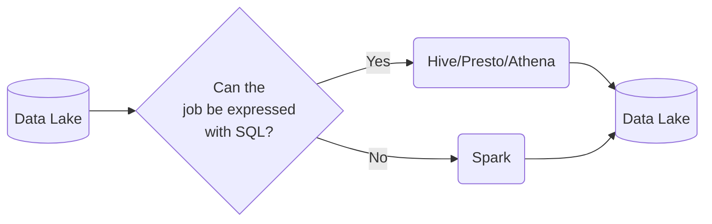
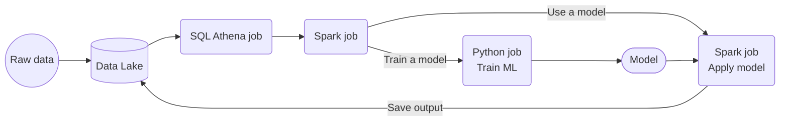
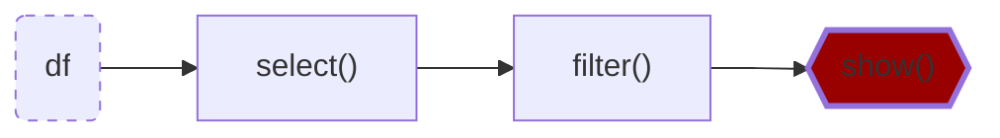
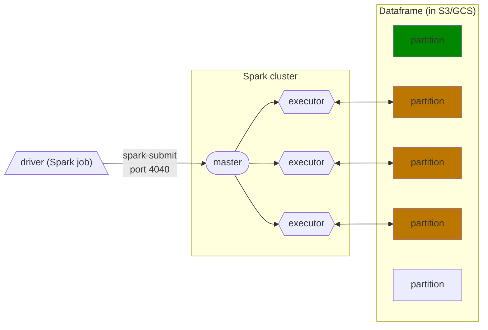
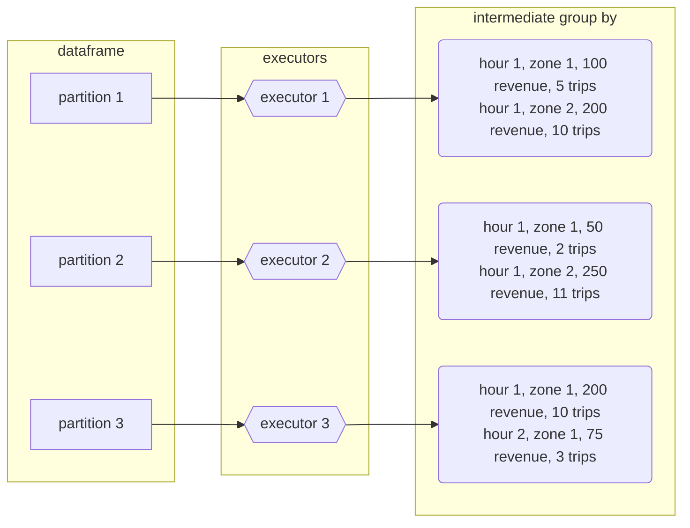
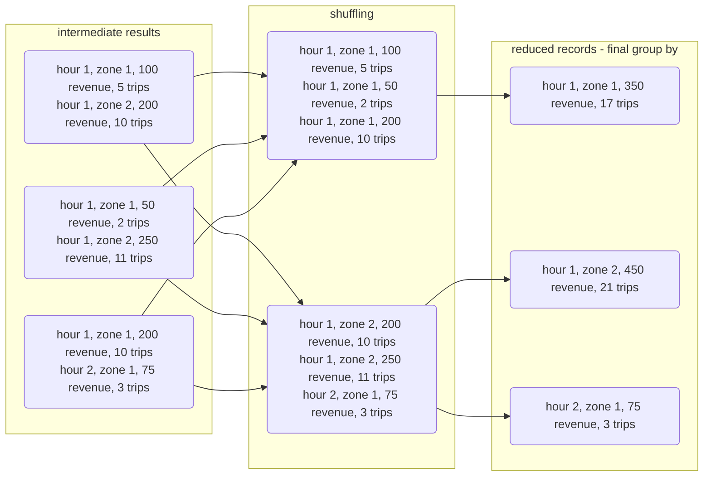
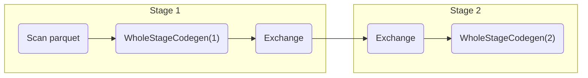
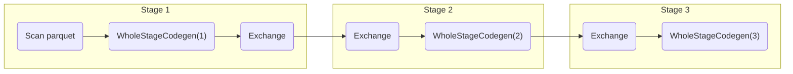

# Introduction to Batch Processing

_[Video source](https://www.youtube.com/watch?v=dcHe5Fl3MF8&list=PL3MmuxUbc_hJed7dXYoJw8DoCuVHhGEQb&index=46)_

## Batch vs Streaming

There are 2 ways of processing data:
* ***Batch processing***: processing _chunks_ of data at _regular intervals_.
    * Example: processing taxi trips each month.
        ```mermaid
        graph LR;
            a[(taxi trips DB)]-->b(batch job)
            b-->a
        ```
* ***Streaming***: processing data _on the fly_.
    * Example: processing a taxi trip as soon as it's generated.
        ```mermaid
        graph LR;
            a{{User}}-. gets on taxi .->b{{taxi}}
            b-- ride start event -->c([data stream])
            c-->d(Processor)
            d-->e([data stream])
        ```

This lesson will cover ***batch processing***. Next lesson will cover streaming.

## Types of batch jobs

A ***batch job*** is a ***job*** (a unit of work) that will process data in batches.

Batch jobs may be _scheduled_ in many ways:

* Weekly
* Daily (very common)
* Hourly (very common)
* X timnes per hous
* Every 5 minutes
* Etc...

Batch jobs may also be carried out using different technologies:

* Python scripts (like the [data pipelines in lesson 1](1_intro.md#creating-a-custom-pipeline-with-docker)).
    * Python scripts can be run anywhere (Kubernets, AWS Batch, ...)
* SQL (like the [dbt models in lesson 4](4_analytics.md#developing-with-dbt)).
* Spark (what we will use for this lesson)
* Flink
* Etc...

## Orchestrating batch jobs

Batch jobs are commonly orchestrated with tools such as [Airflow](2_data_ingestion.md#airflow-architecture).

A common workflow for batch jobs may be the following:



## Pros and cons of batch jobs

* Advantages:
    * Easy to manage. There are multiple tools to manage them (the technologies we already mentioned)
    * Re-executable. Jobs can be easily retried if they fail.
    * Scalable. Scripts can be executed in more capable machines; Spark can be run in bigger clusters, etc.
* Disadvantages:
    * Delay. Each task of the workflow in the previous section may take a few minutes; assuming the whole workflow takes 20 minutes, we would need to wait those 20 minutes until the data is ready for work.

However, the advantages of batch jobs often compensate for its shortcomings, and as a result most companies that deal with data tend to work with batch jobs mos of the time (probably 90%).


# Introduction to Spark

_[Video source](https://www.youtube.com/watch?v=FhaqbEOuQ8U&list=PL3MmuxUbc_hJed7dXYoJw8DoCuVHhGEQb&index=47)_

## What is Spark?

[Apache Spark](https://spark.apache.org/) is an open-source ***multi-language*** unified analytics ***engine*** for large-scale data processing.

Spark is an ***engine*** because it _processes data_.



Spark can be ran in _clusters_ with multiple _nodes_, each pulling and transforming data.

Spark is ***multi-language*** because we can use Java and Scala natively, and there are wrappers for Python, R and other languages.

The wrapper for Python is called [PySpark](https://spark.apache.org/docs/latest/api/python/).

Spark can deal with both batches and streaming data. The technique for streaming data is seeing a stream of data as a sequence of small batches and then applying similar techniques on them to those used on regular badges. We will cover streaming in detail in the next lesson.

## Why do we need Spark?

Spark is used for transforming data in a Data Lake.

There are tools such as Hive, Presto or Athena (a AWS managed Presto) that allow you to express jobs as SQL queries. However, there are times where you need to apply more complex manipulation which are very difficult or even impossible to express with SQL (such as ML models); in those instances, Spark is the tool to use.



A typical workflow may combine both tools. Here's an example of a workflow involving Machine Learning:



In this scenario, most of the preprocessing would be happening in Athena, so for everything that can be expressed with SQL, it's always a good idea to do so, but for everything else, there's Spark.

# Installing Spark

_[Video source](https://www.youtube.com/watch?v=hqUbB9c8sKg&list=PL3MmuxUbc_hJed7dXYoJw8DoCuVHhGEQb&index=48)_

Install instructions for [Linux](https://github.com/DataTalksClub/data-engineering-zoomcamp/blob/main/week_5_batch_processing/setup/linux.md), [MacOS](https://github.com/DataTalksClub/data-engineering-zoomcamp/blob/main/week_5_batch_processing/setup/macos.md) and [Windows](https://github.com/DataTalksClub/data-engineering-zoomcamp/blob/main/week_5_batch_processing/setup/windows.md) are available on the [course repo](https://github.com/DataTalksClub/data-engineering-zoomcamp/tree/main/week_5_batch_processing/setup).

After installing the appropiate JDK and Spark, make sure that you set up PySpark by [following these instructions](https://github.com/DataTalksClub/data-engineering-zoomcamp/blob/main/week_5_batch_processing/setup/pyspark.md).

Test your install by running [this Jupiter Notebook](../5_batch_processing/03_test.ipynb).

# First look at Spark/PySpark

>Note: if you're running Spark and Jupyter Notebook on a remote machine, you will need to redirect ports 8888 for Jupyter Notebook and 4040 for the Spark UI.

## Creating a Spark session

We can use Spark with Python code by means of PySpark. We will be using Jupyter Notebooks for this lesson.

We first need to import PySpark to our code:

```python
import pyspark
from pyspark.sql import SparkSession
```

We now need to instantiate a ***Spark session***, an object that we use to interact with Spark.

```python
spark = SparkSession.builder \
    .master("local[*]") \
    .appName('test') \
    .getOrCreate()
```
* `SparkSession` is the class of the object that we instantiate. `builder` is the builder method.
* `master()` sets the Spark _master URL_ to connect to. The `local` string means that Spark will run on a local cluster. `[*]` means that Spark will run with as many CPU cores as possible.
* `appName()` defines the name of our application/session. This will show in the Spark UI.
* `getOrCreate()` will create the session or recover the object if it was previously created.

Once we've instantiated a session, we can access the Spark UI by browsing to `localhost:4040`. The UI will display all current jobs. Since we've just created the instance, there should be no jobs currently running.

## Reading CSV files

Similarlly to Pandas, Spark can read CSV files into ***dataframes***, a tabular data structure. Unlike Pandas, Spark can handle much bigger datasets but it's unable to infer the datatypes of each column.

>Note: Spark dataframes use custom data types; we cannot use regular Python types.

For this example we will use the [High Volume For-Hire Vehicle Trip Records for January 2021](https://nyc-tlc.s3.amazonaws.com/trip+data/fhvhv_tripdata_2021-01.csv) available from the [NYC TLC Trip Record Data webiste](https://www1.nyc.gov/site/tlc/about/tlc-trip-record-data.page). The file should be about 720MB in size.

Let's read the file and create a dataframe:

```python
df = spark.read \
    .option("header", "true") \
    .csv('fhvhv_tripdata_2021-01.csv')
```
* `read()` reads the file.
* `option()` contains options for the `read` method. In this case, we're specifying that the first line of the CSV file contains the column names.
* `csv()` is for readinc CSV files.

You can see the contents of the dataframe with `df.show()` (only a few rows will be shown) or `df.head()`. You can also check the current schema with `df.schema`; you will notice that all values are strings.

We can use a trick with Pandas to infer the datatypes:
1. Create a smaller CSV file with the first 1000 records or so.
1. Import Pandas and create a Pandas dataframe. This dataframe will have inferred datatypes.
1. Create a Spark dataframe from the Pandas dataframe and check its schema.
    ```python
    spark.createDataFrame(my_pandas_dataframe).schema
    ```
1. Based on the output of the previous method, import `types` from `pyspark.sql` and create a `StructType` containing a list of the datatypes.
    ```python
    from pyspark.sql import types
    schema = types.StructType([...])
    ```
    * `types` contains all of the available data types for Spark dataframes.
1. Create a new Spark dataframe and include the schema as an option.
    ```python
    df = spark.read \
        .option("header", "true") \
        .schema(schema) \
        .csv('fhvhv_tripdata_2021-01.csv')
    ```

You may find an example Jupiter Notebook file using this trick [in this link](../5_batch_processing/04_pyspark.ipynb).

## Partitions

A ***Spark cluster*** is composed of multiple ***executors***. Each executor can process data independently in order to parallelize and speed up work.

In the previous example we read a single large CSV file. A file can only be read by a single executor, which means that the code we've written so far isn't parallelized and thus will only be run by a single executor rather than many at the same time.

In order to solve this issue, we can _split a file into multiple parts_ so that each executor can take care of a part and have all executors working simultaneously. These splits are called ***partitions***.

We will now read the CSV file, partition the dataframe and parquetize it. This will create multiple files in parquet format.

>Note: converting to parquet is an expensive operation which may take several minutes.

```python
# create 24 partitions in our dataframe
df = df.repartition(24)
# parquetize and write to fhvhv/2021/01/ folder
df.write.parquet('fhvhv/2021/01/')
```

You may check the Spark UI at any time and see the progress of the current job, which is divided into stages which contain tasks. The tasks in a stage will not start until all tasks on the previous stage are finished.

When creating a dataframe, Spark creates as many partitions as CPU cores available by default, and each partition creates a task. Thus, assuming that the dataframe was initially partitioned into 6 partitions, the `write.parquet()` method will have 2 stages: the first with 6 tasks and the second one with 24 tasks.

Besides the 24 parquet files, you should also see a `_SUCCESS` file which should be empty. This file is created when the job finishes successfully.

Trying to write the files again will output an error because Spark will not write to a non-empty folder. You can force an overwrite with the `mode` argument:

```python
df.write.parquet('fhvhv/2021/01/', mode='overwrite')
```

## Spark dataframes

[As we said before](#reading-csv-files), Spark works with ***dataframes***.

We can create a dataframe from the parquet files we created in the previous section:

```python
df = spark.read.parquet('fhvhv/2021/01/')
```

Unlike CSV files, parquet files contain the schema of the dataset, so there is no need to specify a schema like we previously did when reading the CSV file. You can check the schema like this:

```python
df.printSchema()
```

(One of the reasons why parquet files are smaller than CSV files is because they store the data according to the datatypes, so integer values will take less space than long or string values.)

There are many Pandas-like operations that we can do on Spark dataframes, such as:
* Column selection - returns a dataframe with only the specified columns.
    ```python
    new_df = df.select('pickup_datetime', 'dropoff_datetime', 'PULocationID', 'DOLocationID')
    ```
* Filtering by value - returns a dataframe whose records match the condition stated in the filter.
    ```python
    new_df = df.select('pickup_datetime', 'dropoff_datetime', 'PULocationID', 'DOLocationID').filter(df.hvfhs_license_num == 'HV0003')
    ```
* And many more. The official Spark documentation website contains a [quick guide for dataframes](https://spark.apache.org/docs/latest/api/python/getting_started/quickstart_df.html).

## Actions vs Transformations

Some Spark methods are "lazy", meaning that they are not executed right away. You can test this with the last instructions we run in the previous section: after running them, the Spark UI will not show any new jobs. However, running `df.show()` right after will execute right away and display the contents of the dataframe; the Spark UI will also show a new job.

These lazy commands are called ***transformations*** and the eager commands are called ***actions***. Computations only happen when actions are triggered.
```python
df.select(...).filter(...).show()
```

Both `select()` and `filter()` are _transformations_, but `show()` is an _action_. The whole instruction gets evaluated only when the `show()` action is triggered.

List of transformations (lazy):
* Selecting columns
* Filtering
* Joins
* Group by
* Partitions
* ...

List of actions (eager):
* Show, take, head
* Write, read
* ...

## Functions and User Defined Functions (UDFs)

Besides the SQL and Pandas-like commands we've seen so far, Spark provides additional built-in functions that allow for more complex data manipulation. By convention, these functions are imported as follows:

```python
from pyspark.sql import functions as F
```

Here's an example of built-in function usage:
```python
df \
    .withColumn('pickup_date', F.to_date(df.pickup_datetime)) \
    .withColumn('dropoff_date', F.to_date(df.dropoff_datetime)) \
    .select('pickup_date', 'dropoff_date', 'PULocationID', 'DOLocationID') \
    .show()
```
* `withColumn()` is a ***transformation*** that adds a new column to the dataframe.
    * ***IMPORTANT***: adding a new column with the same name as a previously existing column will overwrite the existing column!
* `select()` is another transformation that selects the stated columns.
* `F.to_date()` is a built-in Spark function that converts a timestamp to date format (year, month and day only, no hour and minute).

A list of built-in functions is available [in the official Spark documentation page](https://spark.apache.org/docs/latest/api/sql/index.html).

Besides these built-in functions, Spark allows us to create ***User Defined Functions*** (UDFs) with custom behavior for those instances where creating SQL queries for that behaviour becomes difficult both to manage and test.

UDFs are regular functions which are then passed as parameters to a special builder. Let's create one:

```python
# A crazy function that changes values when they're divisible by 7 or 3
def crazy_stuff(base_num):
    num = int(base_num[1:])
    if num % 7 == 0:
        return f's/{num:03x}'
    elif num % 3 == 0:
        return f'a/{num:03x}'
    else:
        return f'e/{num:03x}'

# Creating the actual UDF
crazy_stuff_udf = F.udf(crazy_stuff, returnType=types.StringType())
```
* `F.udf()` takes a function (`crazy_stuff()` in this example) as parameter as well as a return type for the function (a string in our example).
* While `crazy_stuff()` is obviously non-sensical, UDFs are handy for things such as ML and other complex operations for which SQL isn't suitable or desirable. Python code is also easier to test than SQL.

We can then use our UDF in transformations just like built-in functions:

```python
df \
    .withColumn('pickup_date', F.to_date(df.pickup_datetime)) \
    .withColumn('dropoff_date', F.to_date(df.dropoff_datetime)) \
    .withColumn('base_id', crazy_stuff_udf(df.dispatching_base_num)) \
    .select('base_id', 'pickup_date', 'dropoff_date', 'PULocationID', 'DOLocationID') \
    .show()
```

# Spark SQL

We already mentioned at the beginning that there are other tools for expressing batch jobs as SQL queries. However, Spark can also run SQL queries, which can come in handy if you already have a Spark cluster and setting up an additional tool for sporadic use isn't desirable.
## Combining the 2 datasets

>Note: this block makes use of the yellow and green taxi datasets for 2020 and 2021 as parquetized local files. You may create a DAG with Airflow [as seen on lesson 2](2_data_ingestion.md#creating-a-dag) or you may download and parquetize the files directly; [check out this extra lesson](extra1_preparing_data.md) to see how.

Let's now load all of the yellow and green taxi data for 2020 and 2021 to Spark dataframes.

Assuning the parquet files for the datasets are stored on a `data/pq/color/year/month` folder structure:

```python
df_green = spark.read.parquet('data/pq/green/*/*')
df_green = df_green \
    .withColumnRenamed('lpep_pickup_datetime', 'pickup_datetime') \
    .withColumnRenamed('lpep_dropoff_datetime', 'dropoff_datetime')

df_yellow = spark.read.parquet('data/pq/yellow/*/*')
df_yellow = df_yellow \
    .withColumnRenamed('tpep_pickup_datetime', 'pickup_datetime') \
    .withColumnRenamed('tpep_dropoff_datetime', 'dropoff_datetime')
```
* Because the pickup and dropoff column names don't match between the 2 datasets, we use the `withColumnRenamed` action to make them have matching names.

We will replicate the [`dm_monthyl_zone_revenue.sql`](https://github.com/DataTalksClub/data-engineering-zoomcamp/blob/main/week_4_analytics_engineering/taxi_rides_ny/models/core/dm_monthly_zone_revenue.sql) model from [lesson 4](4_analytics.md) in Spark. This model makes use of `trips_data`, a combined table of yellow and green taxis, so we will create a combined dataframe with the common columns to both datasets.

We need to find out which are the common columns. We could do this:

```python
set(df_green.columns) & set(df_yellow.columns)
```

However, this command will not respect the column order. We can do this instead to respect the order:

```python
common_colums = []

yellow_columns = set(df_yellow.columns)

for col in df_green.columns:
    if col in yellow_columns:
        common_colums.append(col)
```

Before we combine the datasets, we need to figure out how we will keep track of the taxi type for each record (the `service_type` field in `dm_monthyl_zone_revenue.sql`). We will add the `service_type` column to each dataframe.

```python
from pyspark.sql import functions as F

df_green_sel = df_green \
    .select(common_colums) \
    .withColumn('service_type', F.lit('green'))

df_yellow_sel = df_yellow \
    .select(common_colums) \
    .withColumn('service_type', F.lit('yellow'))
```
* `F.lit()` adds a _literal_ or constant to a dataframe. We use it here to fill the `service_type` column with a constant value, which is its corresponging taxi type.

Finally, let's combine both datasets:

```python
df_trips_data = df_green_sel.unionAll(df_yellow_sel)
```

We can also count the amount of records per taxi type:

```python
df_trips_data.groupBy('service_type').count().show()
```

## Querying a dataset with Temporary Tables

We can make SQL queries with Spark with `spark.sqll("SELECT * FROM ???")`. SQL expects a table for retrieving records, but a dataframe is not a table, so we need to ***register*** the dataframe as a table first:

```python
df_trips_data.registerTempTable('trips_data')
```
* This method creates a ***temporary table*** with the name `trips_data`.
* ***IMPORTANT***: According to the [official docs](https://spark.apache.org/docs/latest/api/python/reference/api/pyspark.sql.DataFrame.registerTempTable.html), this method is deprecated.

With our registered table, we can now perform regular SQL operations.

```python
spark.sql("""
SELECT
    service_type,
    count(1)
FROM
    trips_data
GROUP BY 
    service_type
""").show()
```
* This query outputs the same as `df_trips_data.groupBy('service_type').count().show()`
* Note that the SQL query is wrapped with 3 double quotes (`"`).

The query output can be manipulated as a dataframe, which means that we can perform any queries on our table and manipulate the results with Python as we see fit.

We can now slightly modify the [`dm_monthyl_zone_revenue.sql`](https://github.com/DataTalksClub/data-engineering-zoomcamp/blob/main/week_4_analytics_engineering/taxi_rides_ny/models/core/dm_monthly_zone_revenue.sql), and run it as a query with Spark and store the output in a dataframe:

```python
df_result = spark.sql("""
SELECT 
    -- Reveneue grouping 
    PULocationID AS revenue_zone,
    date_trunc('month', pickup_datetime) AS revenue_month, 
    service_type, 

    -- Revenue calculation 
    SUM(fare_amount) AS revenue_monthly_fare,
    SUM(extra) AS revenue_monthly_extra,
    SUM(mta_tax) AS revenue_monthly_mta_tax,
    SUM(tip_amount) AS revenue_monthly_tip_amount,
    SUM(tolls_amount) AS revenue_monthly_tolls_amount,
    SUM(improvement_surcharge) AS revenue_monthly_improvement_surcharge,
    SUM(total_amount) AS revenue_monthly_total_amount,
    SUM(congestion_surcharge) AS revenue_monthly_congestion_surcharge,

    -- Additional calculations
    AVG(passenger_count) AS avg_montly_passenger_count,
    AVG(trip_distance) AS avg_montly_trip_distance
FROM
    trips_data
GROUP BY
    1, 2, 3
""")
```
* We removed the `with` statement from the original query because it operates on an external table that Spark does not have access to.
* We removed the `count(tripid) as total_monthly_trips,` line in _Additional calculations_ because it also depends on that external table.
* We change the grouping from field names to references in order to avoid mistakes.

SQL queries are transformations, so we need an action to perform them such as `df_result.show()`.

Once we're happy with the output, we can also store it as a parquet file just like any other dataframe. We could run this:

```python
df_result.write.parquet('data/report/revenue/')
```

However, with our current dataset, this will create more than 200 parquet files of very small size, which isn't very desirable.

In order to reduce the amount of files, we need to reduce the amount of partitions of the dataset, which is done with the `coalesce()` method:

```python
df_result.coalesce(1).write.parquet('data/report/revenue/', mode='overwrite')
```
* This reduces the amount of partitions to just 1.

# Spark internals

## Spark Cluster

Until now, we've used a ***local cluster*** to run our Spark code, but Spark clusters often contain multiple computers that behace as executors.

Spark clusters are managed by a ***master***, which behaves similarly to an entry point of a Kubernetes cluster. A ***driver*** (an Airflow DAG, a computer running a local script, etc.) that wants to execute a Spark job will send the job to the master, which in turn will divide the work among the cluster's executors. If any executor fails and becomes offline for any reason, the master will reassign the task to another executor.



Each executor will fetch a ***dataframe partition*** stored in a ***Data Lake*** (usually S3, GCS or a similar cloud provider), do something with it and then store it somewhere, which could be the same Data Lake or somewhere else. If there are more partitions than executors, executors will keep fetching partitions until every single one has been processed.

This is in contrast to [Hadoop](https://hadoop.apache.org/), another data analytics engine, whose executors locally store the data they process. Partitions in Hadoop are duplicated across several executors for redundancy, in case an executor fails for whatever reason (Hadoop is meant for clusters made of commodity hardware computers). However, data locality has become less important as storage and data transfer costs have dramatically decreased and nowadays it's feasible to separate storage from computation, so Hadoop has fallen out of fashion.

## GROUP BY in Spark

Let's do the following query:

```python
df_green_revenue = spark.sql("""
SELECT 
    date_trunc('hour', lpep_pickup_datetime) AS hour, 
    PULocationID AS zone,

    SUM(total_amount) AS amount,
    COUNT(1) AS number_records
FROM
    green
WHERE
    lpep_pickup_datetime >= '2020-01-01 00:00:00'
GROUP BY
    1, 2  
""")
```

This query will output the total revenue and amount of trips per hour per zone. We need to group by hour and zones in order to do this.

Since the data is split along partitions, it's likely that we will need to group data which is in separate partitions, but executors only deal with individual partitions. Spark solves this issue by separating the grouping in 2 stages:

1. In the first stage, each executor groups the results in the partition they're working on and outputs the results to a temporary partition. These temporary partitions are the ***intermediate results***.



2. The second stage ***shuffles*** the data: Spark will put all records with the ***same keys*** (in this case, the `GROUP BY` keys which are hour and zone) in the ***same partition***. The algorithm to do this is called _external merge sort_. Once the shuffling has finished, we can once again apply the `GROUP BY` to these new partitions and ***reduce*** the records to the ***final output***.
    * Note that the shuffled partitions may contain more than one key, but all records belonging to a key should end up in the same partition.



Running the query should display the following DAG in the Spark UI:


* The `Exchange` task refers to the shuffling.

If we were to add sorting to the query (adding a `ORDER BY 1,2` at the end), Spark would perform a very similar operation to `GROUP BY` after grouping the data. The resulting DAG would look liked this:



By default, Spark will repartition the dataframe to 200 partitions after shuffling data. For the kind of data we're dealing with in this example this could be counterproductive because of the small size of each partition/file, but for larger datasets this is fine.

Shuffling is an ***expensive operation***, so it's in our best interest to reduce the amount of data to shuffle when querying.
* Keep in mind that repartitioning also involves shuffling data.

___

# Joins in Spark
## joining 2 large tables
## merge sort join
## joining a large and a small table
## broadcasting

# RDDs
## From DF to RDD
## map
## reduce
## mapPartition
## From RDD to DF

# Spark internals
## driver, master and executors
## partitioning + coalesce
## shuffling
## group by or notg group by?
## broadcasting

# Spark and Docker

# Running Spark in the Cloud (GCP)

# Connecting Spark to a DWH
## Spark with BigQuery (Athena/presto/hive/etc - similar)
## reading from GCP and saving to BG